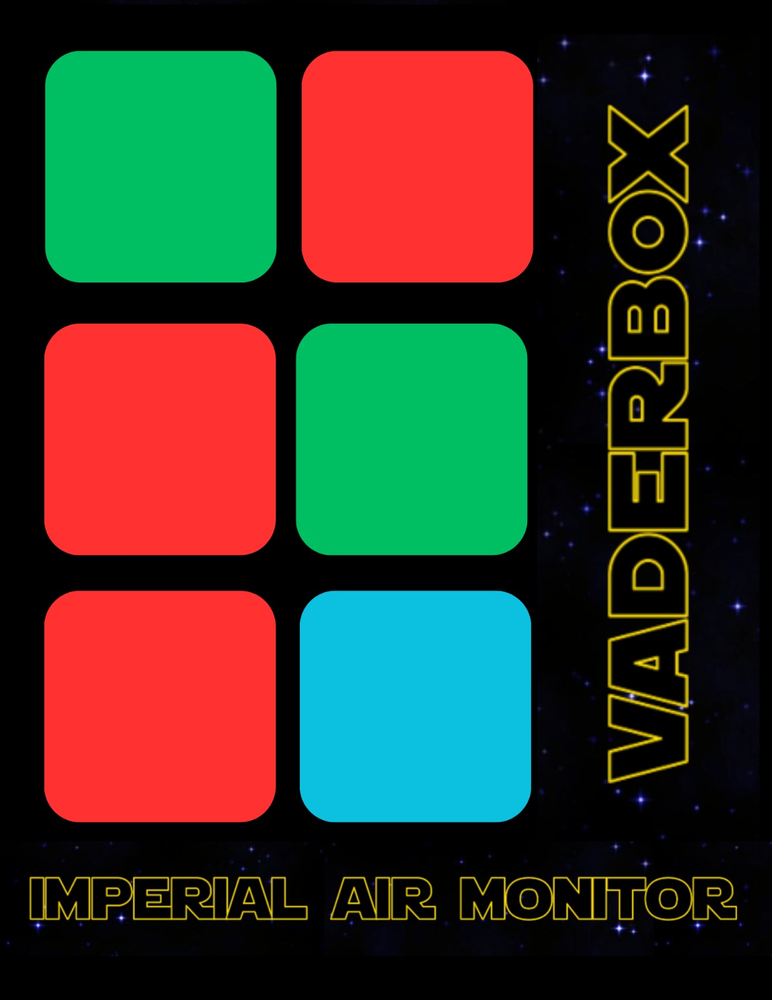
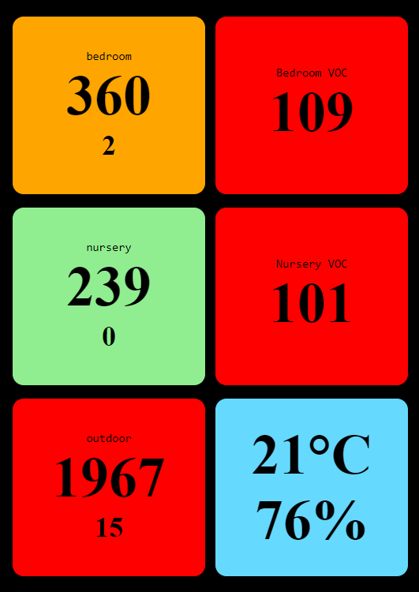

# What on Dagobah is this?
Inspired by Darth Vader's chest box, this air quality monitor is meant to be displayed in "kiosk" mode on mobile devices. Each row represents a sensor. PM 0.3/2.5 data on left, and VOC data (if available) on right.
The bottom right box displays outdoor weather and humidity from OpenWeatherMap.

# Requirements

You will need to edit the js/script.js with your sensor API endpoints, as well as your OpenWeatherMap API key.

Currently, this app is setup to get JSON data from three PurpleAir™ sensors. Of course, you may change the implementation as per your liking.

# Future Plans
I'd like to get the data from my ecobee thermostat and also display the indoor temperature/humidity at some point.

 
# Screenshot

